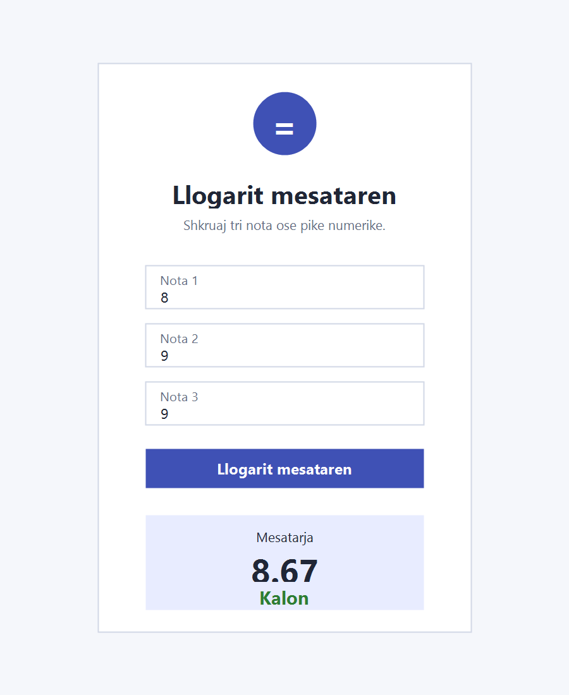

# Grade Calculator UI

Day 1 - Task 2 Flutter project for the Internal Internship.

The app calculates the average of three numeric grades and shows whether the result is passing.

Passing status:
- `Kalon` when the average is 5.00 or higher.
- `Duhet përmirësim` when the average is lower than 5.00.

Screenshot:

